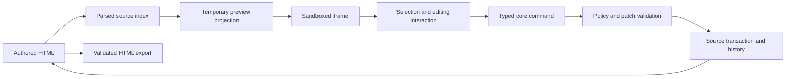

# Architecture

This describes the implemented alpha. Start with the [contributor map](./docs/contributor-map.md) to locate code and tests. Historical proposals are retained under [docs/design](./docs/design/README.md); they do not define the current public API.

## Package boundaries

| Location | Responsibility | Runtime dependencies within this repository |
| --- | --- | --- |
| `packages/core` | HTML source, parsing, profiles, commands, transactions, history, validation, preview projection, and export | None |
| `packages/deck` | Ordered standalone HTML slides, deck history, serialization, and the Claude Design adapter | None |
| `packages/react` | React lifecycle bindings and the default editing workspace | Core and deck |
| `apps/showcase` | Example host application, sample documents, and landing demo | Public exports of all three packages |

Core and deck have no React dependency. Deck manages slide documents; a host composes a core controller for each slide it edits. React depends on deck for its optional navigator. These are the three published packages; additional package splits require an ADR.

## Editing flow

The authored string is canonical. Parsing supplies source ranges and node identities. The preview adds temporary runtime attributes and styles; those additions are not serialized as the exported document. Durable edits go through the controller and source patcher, then rebuild the parsed index and preview.

The core currently edits a single HTML source document, including inline styles and embedded stylesheets. Multi-file workspaces and editable external stylesheets remain proposals. `WorkspaceSnapshot` names do not imply that those proposals are implemented.

`EditorController` owns document revisions, transactions, history, checkpoints, profile validation, and typed events. The host owns persistence and calls `createCheckpoint()` after saving successfully. Deck structure has its own history; hosts combine deck dirty state with active-document dirty state through `workspaceDirty`.

## React internals

`HtmlEditor` and `useHtmlEditor` manage a controller for controlled string integrations. `VisualHtmlEditor` accepts a host-owned controller and coordinates canvas lifecycle, commands, selection state, and the workspace shell.

The default workspace is organized by responsibility:

- `editor-types.ts`: public props, asset adapters, and import contracts. Existing package exports remain the API boundary.
- `runtime-selection.ts`: iframe hit testing, text ranges, editing regions, and selection restoration.
- `runtime-attributes.ts`: runtime attribute binding and source-rich-text extraction.
- `layout-geometry.ts` and `text-edit-history.ts`: coordinate conversion and active text history.
- `component-outline.tsx`: source-backed layer tree and semantic labels.
- `inspector-controls.tsx`, `inspector-body.tsx`, and `inspector-values.ts`: property controls, sections, and rendered-value normalization.
- `use-html-import.ts` and `html-import-dialog.tsx`: import preparation, replacement state, modal focus, and confirmation.
- `browser-files.ts`: local file reading and HTML downloads.

Internal modules are not new public extension points. Use package exports, profile configuration, documented adapters, and the existing toolbar/sidebar slots. More granular inspector composition remains on the roadmap.

## Security and source fidelity

Core policy validates tags, attributes, protocols, styles, and commands. Preview isolation and export validation complement that policy. The host owns authentication, authorization, asset credentials, persistence, and publishing. See the [security model](./docs/security.md) for the actual integration boundary.

Mixed-text wording and Bold formatting are source-backed operations. Plain-text paste is supported; general rich clipboard HTML and additional built-in formatting controls remain future work. Source editing and HTML importing are controlled by profiles.

## Review and validation

Public APIs are represented by the complete local declaration graph under [api](./api/README.md). Entry-point changes, imported public types, and subpath declarations are included. API snapshots are review artifacts, not a second implementation.

Package tests stay beside code; repository scenarios and packed consumers live under `tests`. See [test architecture](./tests/README.md) and [compatibility](./docs/compatibility.md). Architecture or package-boundary changes should include an [ADR](./docs/adr/README.md).
