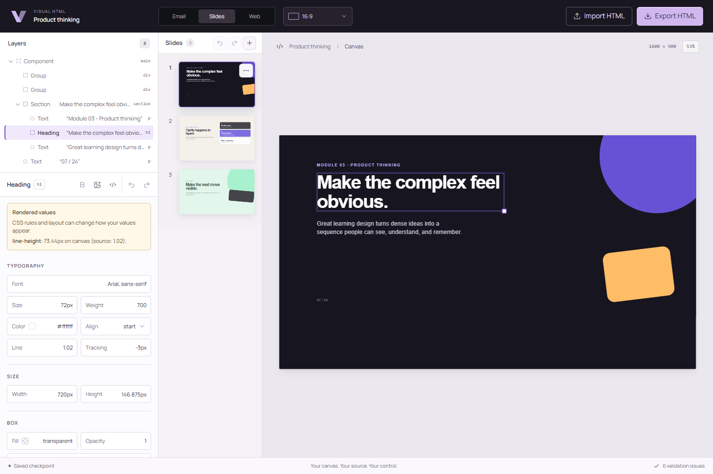

# Visual HTML

**Visual editing for the HTML your product already has.**

Visual HTML brings visual editing to the HTML your product already has. Let users customize emails, presentations, learning materials, and web content directly—without needing to write code or rebuild content in a new format. Developers control what users can change, while the editor preserves untouched source and exports portable HTML that fits existing workflows.

[Try it locally](#try-it-locally) · [Integrate with React](#embed-in-your-product) · [Documentation](#documentation) · [Contribute](#contributing)



*The working React editor, shown with the Slides preset. Email and Web use the same editor with different editing rules and viewports.*

> **Pre-release alpha.** The core editing workflow is available for evaluation and early integration. APIs and compatibility are still evolving toward `1.0`. Until the first npm release is published, use the local workspace. See the [roadmap](./ROADMAP.md) and [API stability policy](./docs/versioning.md).

## When to use it

Your application already stores, imports, or generates HTML. Now someone needs to change the content visually and send the result back through your existing workflow.

| What your users need | What you can build |
| --- | --- |
| Customize an email's wording, images, and appearance | An embedded template editor that works with your existing HTML and delivery pipeline |
| Revise a presentation, lesson, or other learning material | A visual workspace for HTML slides and decks, with text editing, positioning, and resizing |
| Update a page, report, or reusable content fragment | An editor inside your CMS, SaaS product, or internal tool, with allowed changes defined by you |

The HTML can come from your team, a template library, or a generation tool. Visual HTML provides the editing step; your application owns storage, assets, and publishing.

## Why Visual HTML

- **Start with your existing HTML.** Load complete documents or fragments without rebuilding them in an editor-specific component schema.
- **Keep small edits small.** Text, style, and attribute changes are applied to source, preserving untouched regions instead of rewriting the whole document from the browser DOM.
- **Define the editing rules.** Configure allowed tags, attributes, CSS properties, URLs, and operations. Core commands enforce those rules as well as the UI.
- **Keep your content portable.** Export HTML without editor runtime markers or a dependency on the editor to display it.
- **Choose your integration depth.** Embed the React workspace or use the framework-neutral core for commands, validation, history, and export.

### A wording change should look like a wording change

Changing “beautiful” to “wonderful” inside mixed formatting keeps the existing tags, attribute syntax, and surrounding source:

```diff
 <section data-layout="keep">
-  <p>Hello <em class='accent'>beautiful</em> world &amp; friends.</p>
+  <p>Hello <em class='accent'>wonderful</em> world &amp; friends.</p>
 </section>
```

The [source-fidelity tests](./tests/unit/source-fidelity.test.ts) check unchanged round trips, minimal text edits, and exact undo against the [compatibility fixtures](./tests/fixtures/compatibility/manifest.ts). Preservation is scoped to supported operations: changes to inline structure can replace the edited region. See [rich-text behavior](./docs/rich-text.md).

## Try it locally

Use Node.js **24.11.1** (pinned in `.nvmrc`) and pnpm **10.22.0**. See [development setup](./CONTRIBUTING.md#development-setup) for toolchain details. Clone this repository using its **Code** menu, or download and extract the ZIP, then open a terminal in the repository folder:

```bash
npm install --global pnpm@10.22.0
pnpm install --frozen-lockfile
pnpm dev
```

Open the [local editor](http://127.0.0.1:4173/#/editor), then:

1. Choose **Email**, **Slides**, or **Web** to load an example.
2. Click some text and change its wording. Select an element to adjust its available styles.
3. Use **Undo** to restore an edit, or **Source** to inspect the HTML.
4. Choose **Export HTML** to download the result.

To try your own `.html` file, choose **Email** or **Web**, then **Import HTML**. Review the reported issues and confirm the replacement. Slide-deck imports use a format adapter; see [importing HTML and decks](./docs/importing.md).

The showcase runs locally without an account or a Visual HTML backend. Imported HTML may reference remote assets.

## Embed in your product

Pass your HTML into the React workspace and receive the updated source after each committed edit:

```tsx
import { useState } from 'react';
import { webProfile } from '@visual-html/core';
import { HtmlEditor } from '@visual-html/react';
import '@visual-html/react/styles.css';

export function ContentEditor({ initialHtml }: { initialHtml: string }) {
  const [html, setHtml] = useState(initialHtml);

  return (
    <HtmlEditor
      value={html}
      profile={webProfile}
      documentTitle="My content"
      onChange={({ html: nextHtml }) => setHtml(nextHtml)}
    />
  );
}
```

This example keeps edits in React state. Your application handles persistence. Use `emailProfile` for email or `slidesProfile` for a fixed HTML canvas; add `@visual-html/deck` for a collection of slides.

The local showcase resolves these packages from workspace source. For a separate application before npm publication, follow the [local package integration guide](./docs/getting-started.md#try-the-packaged-react-integration).

### Configure what users can change

Extend a preset to fit your workflow. For example, disable source editing, file import, and element deletion while retaining the preset's text and style controls:

```ts
import { extendEditorProfile, webProfile } from '@visual-html/core';

const contentProfile = extendEditorProfile(webProfile, {
  id: 'my-content',
  capabilities: {
    editSource: false,
    importHtml: false,
    deleteElements: false
  }
});
```

Pass `contentProfile` to `HtmlEditor`. Profiles also control HTML and CSS policies and available viewports. See [custom profiles](./docs/custom-profiles.md) for the full pattern.

| Package | Use it for |
| --- | --- |
| [@visual-html/react](./packages/react/README.md) | The ready-to-embed canvas, outline, inspector, and React lifecycle |
| [@visual-html/core](./packages/core/README.md) | HTML source editing, policy validation, undo/redo, and export without React |
| [@visual-html/deck](./packages/deck/README.md) | Ordered HTML slides, deck history, serialization, and format adapters |

## Current scope

The alpha supports text editing within mixed inline markup, plain-text paste, Bold, style controls, image insertion and replacement, undo/redo, source editing, HTML import/export, and profile-specific viewports. Fixed-canvas editing includes movement, resizing, and selection of overlapping elements.

Evaluate your own documents against these boundaries:

- **HTML compatibility:** the focus is static HTML and CSS. Runtime-generated React/Vue applications, arbitrary document scripts, and multi-file workspaces are outside the current scope. External stylesheet compatibility is limited.
- **Formatting and layout:** additional inline formatting controls, rich clipboard paste, snapping, rotation, and multi-selection remain future work.
- **Custom interfaces:** the React workspace is opinionated. The core can power another UI, but custom canvases currently need their own pointer and selection integration.
- **Email rendering:** a browser preview does not guarantee email-client rendering. Keep your existing send validation and email-client testing.
- **Validation:** import preserves disallowed source and reports issues; it does not sanitize it. The default UI blocks export on blocking issues. Headless integrations must check the issues returned by `export()` before publishing.

See the [security model](./docs/security.md) and [headless guide](./docs/headless-core.md) for integration responsibilities.

## Documentation

Start with the [documentation index](./docs/README.md).

- [Getting started](./docs/getting-started.md) and [controlled React integration](./docs/controlled-react.md)
- [Custom profiles](./docs/custom-profiles.md), [headless core](./docs/headless-core.md), and [slide decks](./docs/decks.md)
- [Security model](./docs/security.md) and [compatibility](./docs/compatibility.md)
- [Contributor map](./docs/contributor-map.md) and [implemented architecture](./ARCHITECTURE.md)
- [Public declaration reference](./api/README.md) and [versioning](./docs/versioning.md)
- [Roadmap](./ROADMAP.md), [release procedure](./RELEASING.md), and [public release checklist](./docs/public-release-checklist.md)


