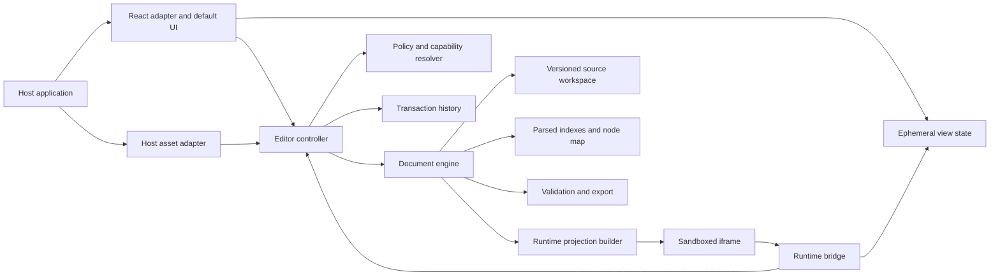
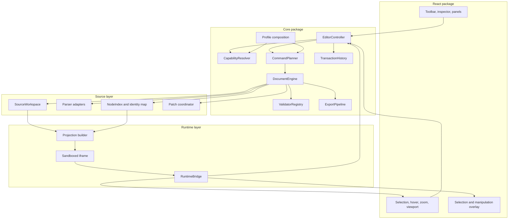
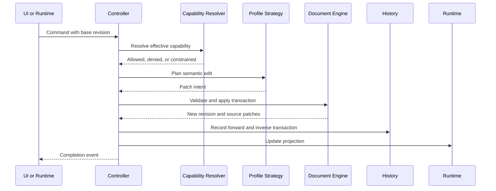
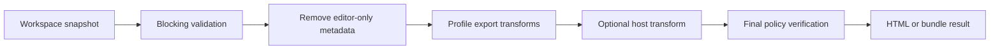

> Historical design document. Retained for context; it includes proposals and superseded decisions. Read the [current architecture](../../ARCHITECTURE.md), [roadmap](../../ROADMAP.md), and [contributor guide](../../CONTRIBUTING.md) for implemented behavior and current work.

# Visual HTML Editor — Finalized Architecture Design

**Status:** Implemented alpha architecture  
**Version:** 1.1  
**Date:** August 15, 2026  
**Related document:** [Product and Technical Requirements](./requirements.md)  
**Implementation status:** Active; implemented coverage and remaining gaps are tracked in [OPEN_SOURCE_READINESS.md](../../OPEN_SOURCE_READINESS.md)

## 1. Purpose

This document defines the target architecture for Visual HTML Editor, an open-source, embeddable visual editor for existing HTML.

The architecture is designed to support different host-product requirements without creating separate editor implementations for email, slides, and responsive web content. It prioritizes:

- Source preservation.
- Browser-accurate rendering.
- Developer-controlled policy.
- Framework independence at the core.
- Safe handling of untrusted HTML.
- Replaceable domain strategies.
- Predictable commands and history.
- Gradual growth from a single HTML document to multi-file bundles.

This document is intentionally more authoritative than any early prototype code. Implementation must conform to the decisions here or introduce an explicit architecture decision record explaining a deviation.

## 2. Architectural summary

Visual HTML Editor uses a source-first architecture.

The canonical document is a versioned source workspace. Parsed syntax trees index the source, and an iframe renders a temporary projection of the current workspace. User interactions never make the runtime DOM authoritative.

The central invariant is:

> Source creates the rendered DOM. User actions create source transactions. The rendered DOM is never serialized back as the canonical source.



## 3. Architectural principles

### 3.1 Source is authoritative

HTML and CSS source files are durable state. Parsed trees, computed styles, iframe nodes, overlays, and UI controls are projections or indexes.

### 3.2 The DOM is disposable

The iframe may be rebuilt at any time from a workspace snapshot. Editor correctness must never depend on serializing the live DOM.

### 3.3 Every durable edit is a transaction

Inline typing, toolbar actions, image insertion, direct manipulation, source edits, and profile-specific changes all become validated transactions against a known document revision.

### 3.4 Policies are enforced below the UI

Hiding a button does not enforce a rule. The command pipeline and export pipeline enforce policy regardless of where an operation originated.

### 3.5 Profiles compose narrow strategies

Email, slides, and responsive web are presets assembled from focused strategy interfaces. They are not subclasses and do not fork the editor.

### 3.6 The core is framework-neutral

The document engine, controller, commands, policies, history, profiles, validation, and export must not import React.

### 3.7 The host owns product concerns

The host application owns persistence, authentication, authorization, publishing, tenancy, analytics, and asset credentials. The editor exposes events and narrow adapters.

### 3.8 Security modes are explicit

Static untrusted editing and trusted interactive preview use different iframe security models. They must not be combined implicitly.

### 3.9 Dependencies remain replaceable

Parsing, source patching, direct-manipulation helpers, code editing, and export transforms sit behind internal boundaries. No third-party library defines the public document model.

## 4. Repository and package boundaries

Visual HTML Editor uses one monorepo with three focused published packages.

```text
visual-html-editor/
├── packages/
│   ├── core/
│   ├── deck/
│   └── react/
├── apps/
│   └── showcase/
├── docs/
├── tests/
├── ARCHITECTURE.md
├── REQUIREMENTS.md
└── OPEN_SOURCE_READINESS.md
```

### 4.1 `@visual-html/core`

Contains:

- Source workspace.
- Parser adapters.
- Node identity and mapping.
- Source patching.
- Commands and transactions.
- Policy and capability resolution.
- History.
- Profiles and strategies.
- Runtime projection builder.
- Validation.
- Export.
- Typed events.

It must have no React dependency.

### 4.2 `@visual-html/react`

Contains:

- React bindings for an editor controller.
- Default toolbar and inspector.
- Canvas shell.
- Selection overlays and handles.
- Ephemeral view state.
- Source editor integration when enabled.
- Theme tokens and compiled styles.

React is a peer dependency of this package only.

### 4.3 `@visual-html/deck`

Contains:

- Ordered collections of complete HTML slide documents.
- Active-slide navigation.
- Add, duplicate, remove, and reorder commands.
- Structural undo and redo independent from each slide's source history.
- Canonical `visual-html-deck` JSON serialization.
- Experimental Claude Design `<deck-stage>` import and export adapters.

The deck package is framework-neutral. It composes existing editor controllers rather than replacing the single-document core model.

### 4.4 Profiles

Profiles remain subpath exports from core until independent release cycles are proven necessary.

```text
@visual-html/core/profiles/email
@visual-html/core/profiles/slides
@visual-html/core/profiles/web
```

### 4.5 Showcase

The showcase is a real integration application. It demonstrates the public API and must not import internal package files.

## 5. Logical component model



## 6. Source workspace

The source workspace models files even when MVP supports only one HTML file.

### 6.1 Workspace snapshot

Conceptual model:

```ts
interface WorkspaceSnapshot {
  revision: number;
  entryFileId: FileId;
  files: ReadonlyMap<FileId, SourceFile>;
}

interface SourceFile {
  id: FileId;
  path: string;
  mediaType: string;
  content: string;
  contentHash: string;
}
```

The initial implementation may support:

- One `text/html` entry file.
- Embedded `<style>` blocks.
- Inline styles.
- External resources resolved for preview but not edited.

The core workspace model may later support:

- Separate CSS files.
- Multiple HTML files within one document workspace.
- Asset manifests.
- Export bundles.

Ordered slide collections are implemented separately by `@visual-html/deck`, where each slide remains a complete standalone HTML document.

### 6.2 Revisions

Every committed source transaction creates a monotonically increasing revision.

Commands must specify the revision they were planned against. A stale command must be rejected or explicitly rebased; it must never silently apply to unrelated source offsets.

### 6.3 Checkpoints

The host may create a saved checkpoint at a revision. Dirty state is derived by comparing the current revision and source hashes with the checkpoint.

The core does not save the checkpoint to a database.

## 7. Parsing and source indexes

### 7.1 Parser boundary

HTML and CSS parsing live behind internal interfaces.

Recommended initial implementations:

- HTML: parse5 with source location information.
- CSS: PostCSS.
- Targeted string patches: MagicString or an equivalent patch engine.

These are implementation choices, not public types.

### 7.2 Parsed index

The parser produces an index containing:

- Authored nodes.
- Source ranges.
- Attribute ranges when available.
- Text ranges.
- Parent and sibling relationships.
- Element fingerprints.
- Embedded style blocks.
- Template and opaque regions.
- Parser-generated virtual nodes.

### 7.3 Virtual nodes

Browsers and standards-compliant parsers may create elements that do not exist in source, such as implied table structure.

Virtual nodes:

- Have runtime identities.
- Have no writable source range.
- May be selectable for navigation.
- Cannot receive direct source edits unless a strategy can safely map the operation to an authored ancestor.

The UI must distinguish an unsupported virtual-node edit from a policy denial.

### 7.4 Template syntax and opaque regions

The source engine must preserve host template syntax such as merge tags, handlebars-like expressions, conditional comments, and vendor placeholders.

An opaque region is source that the parser indexes but does not reinterpret. Profiles may register token recognizers and atomic-editing behavior.

The initial email profile must support configured template-token delimiters.

## 8. Node identity and runtime mapping

Source offsets are not stable identities because preceding edits shift them.

### 8.1 `NodeKey`

`NodeKey` is an opaque session identity. It is never derived publicly from a raw source offset and is not exported unless the host explicitly requests persistent annotations.

### 8.2 Node index entry

Conceptual model:

```ts
interface NodeIndexEntry {
  key: NodeKey;
  revision: number;
  fileId: FileId;
  kind: NodeKind;
  range?: SourceRange;
  parentKey?: NodeKey;
  fingerprint: NodeFingerprint;
  virtual: boolean;
}
```

### 8.3 Remapping after edits

After a transaction:

1. Translate unaffected source ranges through the patch set.
2. Reparse affected files.
3. Match old and new authored nodes using translated ranges, parent relationships, node type, attributes, and local fingerprints.
4. Preserve NodeKeys for confident matches.
5. Assign new NodeKeys to inserted or unmatched nodes.
6. Mark deleted NodeKeys as unavailable.
7. Restore selection to the best surviving NodeKey or ancestor.

Remapping confidence must be observable in development diagnostics.

### 8.4 Runtime identifiers

The projection builder injects ephemeral runtime IDs that map to NodeKeys for the current revision.

Runtime IDs:

- Are never canonical source.
- Are removed from export.
- Must be unique per editor instance.
- Must not collide with host attributes.
- May be regenerated after rerender.

## 9. Document engine

`DocumentEngine` owns source-oriented behavior.

Responsibilities:

- Maintain the current workspace snapshot.
- Parse and index files.
- Resolve NodeKeys.
- Plan and apply source patches.
- Build runtime projections.
- Run validation.
- Produce export results.
- Expose asynchronous read operations.

It does not own:

- React state.
- Toolbar state.
- Current hover state.
- Persistence.
- User authentication.
- Product analytics.

### 9.1 Asynchronous contract

Document-engine operations are asynchronous even when the initial parser runs on the main thread.

This allows parsing, validation, diffing, and export preparation to move into a Web Worker later without changing public consumers.

### 9.2 Determinism

For the same workspace revision, profile, policy, and command, the document engine must produce the same patch plan and validation result.

## 10. Editor controller

`EditorController` coordinates intent and durable changes.

Responsibilities:

- Accept commands from UI, runtime bridge, or host API.
- Resolve effective capabilities.
- Ask profile strategies to plan source changes.
- Begin and commit transactions.
- Coordinate asynchronous asset operations.
- Record transaction history.
- Emit typed events.
- Restore selection intent after transactions.

The controller does not parse HTML directly and does not manipulate iframe DOM as canonical state.

## 11. Commands and transactions

### 11.1 Command model

Commands express user intent rather than implementation details.

Representative commands:

- `SetText`
- `SetRichText`
- `SetAttribute`
- `RemoveAttribute`
- `SetStyle`
- `InsertElement`
- `RemoveElement`
- `DuplicateElement`
- `MoveElement`
- `ResizeElement`
- `ReplaceImage`
- `SetBreakpointStyle`
- `ApplySourceEdit`

### 11.2 Command envelope

Conceptual model:

```ts
interface CommandEnvelope<TCommand> {
  id: CommandId;
  baseRevision: number;
  command: TCommand;
  origin: 'ui' | 'runtime' | 'host';
  timestamp: number;
  metadata?: Readonly<Record<string, unknown>>;
}
```

### 11.3 Command pipeline



### 11.4 Transactions

A transaction contains one or more commands and applies atomically.

Conceptual model:

```ts
interface SourcePatch {
  fileId: FileId;
  start: number;
  end: number;
  expectedHash: string;
  replacement: string;
}

interface DocumentTransaction {
  id: TransactionId;
  baseRevision: number;
  commands: readonly CommandEnvelope<EditorCommand>[];
  forwardPatches: readonly SourcePatch[];
  inversePatches: readonly SourcePatch[];
}
```

Patch requirements:

- Patches for one transaction must not overlap unless merged during planning.
- Expected source hashes must match before application.
- Failure must leave the previous workspace unchanged.
- A successful transaction creates exactly one new revision.

### 11.5 Undo and redo

History stores transactions, not iframe snapshots.

Undo applies inverse patches against the expected current revision. Redo reapplies forward patches. History entries also contain selection-restoration hints and human-readable descriptions.

The initial implementation may retain occasional full workspace checkpoints to recover from corruption or bound inverse-patch chains.

## 12. Policy and capability resolution

### 12.1 Policy layers

Effective policy is composed deterministically from:

1. Core safety defaults.
2. Active profile defaults.
3. Host configuration.
4. Role or tenant rules supplied by the host.
5. Element-specific rules.

Later layers may narrow permissions. Expansion beyond core safety defaults requires an explicit trusted configuration.

### 12.2 Capability result

Capability resolution returns more than a boolean.

```ts
type CapabilityResult =
  | { status: 'allowed' }
  | { status: 'constrained'; constraints: CapabilityConstraints }
  | { status: 'denied'; reason: PolicyIssue };
```

Examples of constraints:

- Allowed CSS units.
- Minimum and maximum dimensions.
- Allowed image types.
- Allowed parent containers.
- Allowed breakpoints.
- Text-only editing.
- Style-only editing.

### 12.3 Enforcement locations

Policy is enforced during:

- Import.
- Preview projection.
- Paste.
- Inline editing.
- Command planning.
- Source editing.
- Asset insertion.
- Validation.
- Export.

## 13. Profile composition

A profile is immutable configuration composed from narrow strategies.

```ts
interface EditorProfile {
  id: string;
  policy: PolicyPreset;
  viewports: readonly ViewportPreset[];
  styleWriter: StyleWriter;
  layoutWriter: LayoutWriter;
  tokenRecognizer?: TokenRecognizer;
  validators: readonly Validator[];
  exportTransforms: readonly ExportTransform[];
  defaultControls: ControlPreset;
}
```

Profiles must not expose an unrestricted service locator or inherit from one another.

### 13.1 Email profile

The email profile composes:

- Table-preserving layout rules.
- Inline-style-first style writing.
- Merge-token recognition.
- Outlook conditional-comment preservation.
- Script and form prohibition.
- Desktop and mobile preview widths.
- Absolute image URL constraints when configured.
- Optional CSS inlining export transform.

Movement that would convert table layout to positioned layout is denied by default.

### 13.2 Slides profile

The slides profile composes:

- Fixed aspect-ratio canvases.
- Ordered multi-slide navigation supplied by `@visual-html/deck`.
- Cached per-slide editor controllers and independent slide source histories.
- Pixel and percentage dimensions.
- Direct movement, resizing, rotation, ordering, snapping, and locking.
- Slide-safe style writing.
- Embedded or bundled image policy.
- Optional learner metadata preservation.

### 13.3 Responsive web profile

The web profile composes:

- Named breakpoints.
- Normal-flow layout rules.
- Flexbox and Grid-aware layout writing.
- Breakpoint-specific style writing.
- Responsive image support.
- Semantic HTML validation.

It must not silently convert normal-flow elements to absolute positioning.

## 14. Style-writing architecture

Style edits are not universally represented as inline style changes.

`StyleWriter` decides where and how to express a style command.

Supported targets may include:

- Existing inline declaration.
- Existing rule in a `<style>` block.
- Existing rule in an editable CSS file.
- New generated selector in an editable style block.
- Breakpoint-specific media rule.

### 14.1 Fidelity modes

The active export fidelity influences permitted style strategies.

#### Preserve

- Prefer existing declarations and rules.
- Reject edits that cannot be represented as a safe minimal patch.
- Preserve untouched source byte-for-byte.

#### Balanced

- Prefer minimal patches.
- Permit limited normalization of the edited declaration, attribute, or node.
- Permit a generated override rule when configured.

#### Normalize

- Permit broader source regeneration.
- Still remove editor instrumentation.
- Must remain explicit; it is never the undocumented default.

## 15. Layout-writing architecture

`LayoutWriter` maps visual intent to source semantics.

Examples:

- Slide movement may update `left`, `top`, or `transform`.
- Flexbox reordering may update `order` or source child order.
- Grid movement may update grid-line declarations.
- Email movement may be denied.

Ambiguous layout operations return alternatives or a structured denial. They do not apply an arbitrary fallback.

## 16. Runtime projection

The runtime projection is an instrumented, noncanonical document generated from a workspace snapshot.

Projection may add:

- Runtime node identifiers.
- Preview-only style sheets.
- Resource base URLs.
- Content Security Policy.
- Editor bridge metadata.
- Placeholders for blocked resources.

Projection must not mutate the source workspace.

### 16.1 Projection output

Conceptual model:

```ts
interface RuntimeProjection {
  revision: number;
  html: string;
  nodeRuntimeMap: ReadonlyMap<RuntimeNodeId, NodeKey>;
  blockedResources: readonly BlockedResource[];
  diagnostics: readonly ProjectionDiagnostic[];
}
```

## 17. Iframe security architecture

### 17.1 Static editing mode

Default mode for untrusted HTML:

- Scripts disabled.
- Same-origin DOM access may be enabled for the parent editor.
- Forms, popups, downloads, and top-level navigation blocked.
- Links intercepted.
- CSP applied to the projection.
- Dangerous content blocked or represented as a placeholder.

Static editing mode must never include both executable untrusted scripts and same-origin sandbox access.

### 17.2 Trusted interactive mode

Deferred mode for interactive prototypes:

- Rendered on a dedicated isolated origin.
- Scripts may execute under a restrictive CSP.
- No same-origin access from the host application.
- Communication only through a versioned `postMessage` protocol.
- Messages validated by origin, source window, schema, and session token.

Trusted interactive mode is not required for MVP.

### 17.3 Preview sanitation versus canonical source

Preview sanitation may suppress content without deleting it from canonical source.

If canonical source contains blocked content, the configured import policy determines whether the document is:

- Rejected.
- Opened read-only.
- Opened with blocked preview content and blocking validation errors.
- Sanitized through an explicit source transaction.

Blocked unsafe content must not silently reappear in export.

## 18. Runtime bridge

`RuntimeBridge` connects iframe events to NodeKeys and controller commands.

Responsibilities:

- Resolve pointer targets to runtime IDs.
- Report hover and selection candidates.
- Report text-editing sessions.
- Report scroll and viewport changes.
- Report element geometry.
- Prevent unsafe navigation behavior.
- Coordinate focus between iframe and parent UI.

The bridge never emits raw DOM nodes through the public API.

## 19. View state and React architecture

View state is ephemeral and belongs to the React package.

Examples:

- Hovered NodeKey.
- Selected NodeKey or NodeKeys.
- Active inspector panel.
- Zoom and pan.
- Current viewport preset.
- Toolbar anchor geometry.
- Open menus and dialogs.
- Inline-editing composition state.

View state must not trigger `onChange` unless it dispatches a durable command.

### 19.1 Default UI

The default UI consists of composable components:

- `VisualHtmlEditor`
- `EditorToolbar`
- `EditorCanvas`
- `ComponentOutline`
- `ElementInspector`
- `ViewportControls`
- `SourcePanel`
- `ValidationPanel`
- `LayersPanel` when implemented

The host may use the complete editor or assemble individual components around the same controller.

### 19.2 Styling

- Published UI uses compiled CSS and CSS custom properties.
- No Tailwind runtime dependency.
- Host applications may override theme variables.
- Editor styles must not leak into the iframe.

## 20. Selection and direct manipulation

### 20.1 Single selection

MVP selection uses runtime hit testing and NodeKeys.

The overlay reads geometry from the runtime bridge and renders outside canonical document source.

### 20.2 Movement and resizing

Pointer interaction produces preview geometry while dragging. A durable command is committed at the end of the interaction, with optional throttled preview commands if required.

The interaction helper is replaceable. The public API must not expose third-party Moveable or Selecto types.

### 20.3 Multi-selection

Multi-selection is deferred. The command model may accept multiple NodeKeys, but no multi-selection library is required in MVP.

### 20.4 Snapping

Snapping is a view-layer concern during interaction. The committed command contains the final semantic result, not snapping-library internals.

## 21. Inline editing

Inline editing uses browser Selection, Range, Input Events, and `contenteditable` behavior through the runtime bridge.

### 21.1 Composition session

Typing must not reparse and rerender the document after every keystroke.

An inline-editing composition session:

1. Captures the starting source revision and NodeKey.
2. Allows local runtime editing.
3. Tracks text or sanitized rich-text changes.
4. Commits after a short idle period, blur, explicit confirmation, or before another durable command.
5. Produces one grouped transaction where practical.

IME composition events must be respected.

### 21.2 Rich text

Native inline editing is the default. Schema-based rich-text editors may be offered later as optional region adapters, but they do not own the complete document.

### 21.3 Paste

Paste behavior is profile and policy controlled:

- Plain text.
- Sanitized inline markup.
- Sanitized rich text.
- Rejected.

Template tokens configured as atomic values cannot be partially edited.

## 22. Asset architecture

The editor defines a narrow asset port.

```ts
interface AssetAdapter {
  validate(file: File, context: AssetContext): Promise<AssetValidation>;
  upload(file: File, context: AssetContext): Promise<ResolvedAsset>;
}
```

The host controls credentials, storage, authorization, CDN behavior, and final URLs.

### 22.1 Asset transaction flow

1. User selects an image.
2. Local policy validates type and size.
3. The host adapter validates and uploads.
4. A temporary preview may be displayed without committing source.
5. Successful upload returns a resolved asset.
6. The controller commits an insert or replace command.
7. Failed uploads leave source unchanged.

## 23. Source editing

Source editing is an optional adapter in the React package.

The initial implementation may use CodeMirror, but public APIs do not expose CodeMirror types.

### 23.1 Source edit transaction

1. Source panel opens at a known workspace revision.
2. User edits a working copy.
3. Parser and policy validation run before commit.
4. Invalid source does not replace the last valid workspace.
5. Accepted source becomes one transaction.
6. Node remapping and projection rebuild follow.

If the underlying workspace changed while the source panel was open, commit must report a revision conflict.

## 24. Validation architecture

Validation is independent from rendering.

Validators may be:

- Synchronous or asynchronous.
- File-level or node-level.
- Core, profile-provided, or host-provided.
- Blocking or advisory.

Conceptual result:

```ts
interface ValidationIssue {
  code: string;
  severity: 'info' | 'warning' | 'error' | 'blocking';
  message: string;
  fileId?: FileId;
  nodeKey?: NodeKey;
  range?: SourceRange;
  suggestedAction?: SuggestedAction;
}
```

Validation runs:

- On import.
- After relevant transactions.
- On demand.
- Before export.

## 25. Export architecture

Export begins from a workspace snapshot, never from iframe DOM.

### 25.1 Export pipeline



### 25.2 Export result

```ts
interface ExportResult {
  revision: number;
  files: readonly ExportedFile[];
  warnings: readonly ValidationIssue[];
  sourceDiff?: SourceDiff;
}
```

### 25.3 No-op guarantee

In preserve mode, importing and exporting a supported document without edits must produce byte-identical source files.

### 25.4 Email transforms

Email CSS inlining, URL rewriting, and compatibility transforms are optional export stages. They must not alter the active editing workspace unless explicitly committed as a source transaction.

## 26. Host events

Events are typed and scoped to one editor controller. No global event bus is permitted.

Representative events:

- `ready`
- `revisionChanged`
- `dirtyChanged`
- `transactionCommitted`
- `transactionRejected`
- `selectionChanged`
- `validationChanged`
- `assetUploadStarted`
- `assetUploadCompleted`
- `assetUploadFailed`
- `exportStarted`
- `exportCompleted`
- `fatalError`

Events include the editor instance ID and relevant revision.

## 27. External document replacement

The host may replace the workspace through an explicit controller operation.

Behavior:

- If the current session is clean, replace and rebuild.
- If dirty, follow a host-configured policy: reject, discard, or request confirmation.
- Automatic source merging is not required for MVP.
- Replacement creates a new history root.

## 28. Error handling

Expected failures use structured results, not untyped thrown strings.

Error categories:

- Policy denial.
- Unsupported edit.
- Revision conflict.
- Parse failure.
- Patch conflict.
- Asset failure.
- Projection failure.
- Validation failure.
- Export failure.
- Internal invariant violation.

Internal invariant violations may throw and trigger a recoverable session reset. User-originated failures must return actionable results.

## 29. Performance architecture

### 29.1 Main-thread responsibilities

- Pointer interaction.
- Selection overlay.
- Focus coordination.
- React rendering.
- Iframe geometry.

### 29.2 Worker-ready responsibilities

- Parsing.
- Node remapping.
- Source diffing.
- Validation.
- Export transforms.

### 29.3 Performance rules

- Do not reload the iframe after every keystroke.
- Group interactive edits into transactions.
- Reparse only affected files initially; incremental parsing may come later.
- Bound history memory.
- Cache parsed indexes by file hash.
- Cancel obsolete asynchronous parse and validation work.
- Tag asynchronous results with the revision they belong to and discard stale results.

## 30. Extension model

MVP does not expose a generic plugin lifecycle.

It exposes narrow, versioned extension ports:

- Profile.
- Policy provider.
- Asset adapter.
- Validator.
- Style writer.
- Layout writer.
- Export transform.
- Custom React control.

A general plugin system may be added only after repeated external extension patterns are observed.

## 31. Public API direction

Conceptual core usage:

```ts
const controller = await createEditorController({
  workspace,
  profile,
  policy,
  assetAdapter
});

controller.subscribe('revisionChanged', handleRevision);
await controller.dispatch(command);
const result = await controller.export();
```

Conceptual React usage:

```tsx
<VisualHtmlEditor
  controller={controller}
  components={customComponents}
  theme={theme}
/>
```

The final API may differ, but it must preserve:

- Controller ownership outside React.
- Explicit asynchronous initialization.
- Typed commands and events.
- Host-controlled lifecycle.

## 32. Testing architecture

### 32.1 Core unit tests

- Command planning.
- Policy precedence.
- Patch application and rollback.
- Node remapping.
- Revision conflicts.
- History.
- Profile strategies.
- Validation.
- Export determinism.

### 32.2 Golden source fixtures

Fixtures must include real-world patterns:

- Email tables.
- Outlook conditional comments.
- Merge tags.
- Malformed but browser-tolerated HTML.
- Embedded styles.
- Responsive media queries.
- Slide positioning.
- Nested Flexbox and Grid.

Tests compare:

- No-op byte identity.
- Expected minimal source diff.
- Rendered output.
- Validation results.

### 32.3 Browser tests

- Iframe isolation.
- Selection geometry.
- Inline editing and IME behavior.
- Pointer movement and resizing.
- Focus transitions.
- Paste policy.
- Cross-browser rendering.

### 32.4 Visual regression tests

Run representative fixtures in Chromium, Firefox, and WebKit. Snapshot editor chrome separately from document content where possible.

### 32.5 Security tests

- Script and handler injection.
- Dangerous protocols.
- Sandbox navigation.
- Malicious SVG and MathML.
- Clipboard bypass attempts.
- Source-view bypass attempts.
- Export-policy bypass attempts.
- Trusted-mode message validation.

## 33. Dependency and licensing architecture

### 33.1 Dependency policy

Core runtime dependencies should be minimal and permissively licensed.

Default allowed licenses:

- MIT.
- Apache-2.0.
- BSD-2-Clause.
- BSD-3-Clause.
- ISC.
- 0BSD.

MPL dependencies require review and should remain development-only unless explicitly approved. GPL, AGPL, SSPL, BUSL, PolyForm, unknown, or unlicensed runtime dependencies are rejected by default.

### 33.2 Repository license

The recommended project license is Apache-2.0 because it remains commercially permissive and includes an explicit patent grant. Final selection requires legal approval before public release.

### 33.3 Compliance controls

- License scan on every pull request.
- Production-dependency license allowlist.
- Lockfile committed.
- Third-party notices generated for releases.
- Software bill of materials generated for releases.
- Optional adapters isolated from core bundles.
- No code copied from proprietary or incompatible copyleft editors.

## 34. Distribution architecture

- ESM-first packages.
- TypeScript declarations included.
- React and React DOM as peer dependencies of the React package.
- Tree-shakeable exports.
- Profiles available through subpath exports.
- Compiled CSS with CSS custom properties.
- No required backend service.
- No runtime dependency on the showcase.
- No Tailwind dependency in published packages.

A browser custom-element wrapper may be added later without changing core.

## 35. Observability and diagnostics

The editor exposes optional development diagnostics without requiring a telemetry service.

Diagnostics may include:

- Current revision.
- Parse duration.
- Projection duration.
- Validation duration.
- Transaction duration.
- Node-remapping confidence.
- Rejected commands.
- Blocked resources.
- Export transform duration.

The library does not send telemetry by default. Hosts may subscribe to events and implement their own analytics.

## 36. Recovery and resilience

- Every transaction is atomic.
- The previous valid workspace remains available after failure.
- Periodic in-memory checkpoints bound inverse-patch recovery cost.
- A projection failure does not mutate source.
- A runtime bridge failure may recreate the iframe from the current revision.
- A fatal document-engine invariant violation surfaces a recoverable error with the last valid snapshot.

## 37. Architecture decisions

### AD-001 — Source-first authority

**Decision:** Source workspace is canonical; iframe DOM is disposable.

**Reason:** Required for clean export and source preservation.

### AD-002 — Framework-neutral core

**Decision:** React is isolated in a separate adapter package.

**Reason:** Supports non-React integrations and clean dependency boundaries.

### AD-003 — Two initial packages

**Decision:** Publish core and React packages only.

**Reason:** Provides a meaningful boundary without premature package fragmentation.

### AD-004 — Transactions and revisions

**Decision:** Every durable edit applies atomically against a base revision.

**Reason:** Prevents stale range corruption and supports deterministic history.

### AD-005 — Opaque NodeKeys

**Decision:** Node identity is session-based and remapped after edits; offsets are revision-specific metadata.

**Reason:** Source offsets are not stable identities.

### AD-006 — Profile composition

**Decision:** Profiles compose narrow strategies and immutable presets.

**Reason:** Avoids product forks and inheritance hierarchies.

### AD-007 — Host-owned persistence

**Decision:** Persistence is not a core adapter.

**Reason:** Storage and autosave are product concerns; events and checkpoints are sufficient.

### AD-008 — Explicit security modes

**Decision:** Static untrusted editing and trusted interactive preview use separate renderer modes.

**Reason:** Their sandbox requirements are incompatible.

### AD-009 — Asynchronous engine contract

**Decision:** Parsing and document-engine APIs are asynchronous from the beginning.

**Reason:** Enables worker migration without public API changes.

### AD-010 — No generic plugin system in MVP

**Decision:** Expose narrow extension ports only.

**Reason:** Prevents unstable lifecycle APIs before real extension needs are known.

### AD-011 — No mandatory multi-selection dependency

**Decision:** Multi-selection is deferred and no selection library is required by core.

**Reason:** Avoids premature dependency and interaction-model commitments.

### AD-012 — Preserve-mode no-op identity

**Decision:** Supported documents opened and exported without edits must remain byte-identical in preserve mode.

**Reason:** This is a primary product differentiator and testable quality standard.

## 38. Deferred decisions

These decisions are intentionally deferred and do not block MVP architecture:

- Exact node-remapping scoring algorithm.
- Direct-manipulation helper library.
- Code editor implementation.
- Rich-text wording replacement and inline marks beyond the source-preserving Bold foundation.
- Multi-selection UI.
- Trusted interactive runtime implementation.
- Custom-element wrapper.
- Collaboration protocol.
- PPTX and PDF export.

Deferred tools must not leak types into core public APIs before selection.

## 39. MVP implementation slices

### Slice 1 — Source engine proof

- Single HTML file workspace.
- Parse and source locations.
- NodeKey assignment.
- Minimal text and attribute patches.
- No-op identity fixtures.
- Revision and transaction model.

### Slice 2 — Static renderer and bridge

- Sandboxed static iframe.
- Runtime identifiers.
- Hover and single selection.
- Geometry reporting.
- Navigation blocking.

### Slice 3 — Inline editing

- Composition session.
- Text command.
- Paste policy.
- Undo and redo.
- Selection restoration.

### Slice 4 — Configurable controls

- Policy resolution.
- Basic style writer.
- Toolbar and inspector.
- Aspect-ratio and viewport presets.

### Slice 5 — Images and profiles

- Asset adapter.
- Insert and replace image commands.
- Email, slides, and web profile presets.
- Domain validators.

### Slice 6 — Export and showcase

- Preserve and balanced exports.
- Source diff.
- Public integration example.
- Golden fixture suite.
- Documentation.

## 40. Architecture acceptance criteria

The architecture is considered implemented correctly when:

1. Core can run without React installed.
2. The iframe can be destroyed and recreated without source loss.
3. No-op preserve-mode export is byte-identical for supported fixtures.
4. Every durable edit records a transaction with a base and resulting revision.
5. Stale commands are rejected rather than applied to shifted source ranges.
6. Editor-only runtime identifiers never appear in export.
7. Policy enforcement cannot be bypassed through source mode or paste.
8. Email, slide, and web behavior are supplied through profile strategies rather than editor forks.
9. Host persistence is implemented entirely through events and host code.
10. React UI can be replaced while preserving the same controller and document engine.
11. Parsing can move to a worker without changing the public controller API.
12. Optional editor libraries do not appear in core public types.

## 41. Final architecture statement

Visual HTML Editor is a source-preserving document engine with a browser projection and replaceable user interface.

Its cleanest boundary is:

```text
Host product
  → React adapter or another future adapter
  → EditorController
  → versioned commands and policy
  → DocumentEngine
  → source workspace and patches
  → disposable iframe projection
```

This design scales by adding strategies, validators, profiles, and adapters around a small source-first kernel. It avoids separate editors for each domain, avoids making React or the browser DOM authoritative, and avoids prematurely committing to optional interaction libraries.
